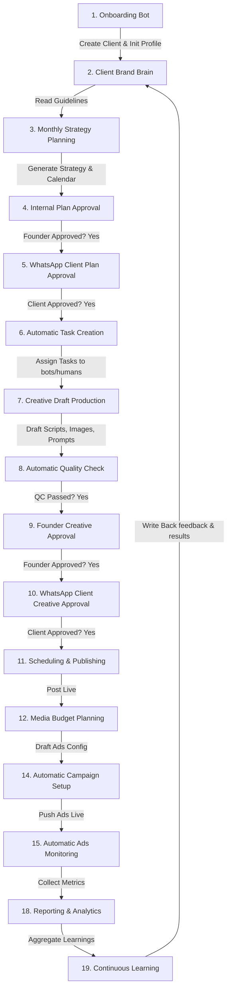

# AGENTS.md — Permanent Project Specification & Agent Runbook

Welcome to **tbw-os** (TBW Operations System). This document is the single source of truth for the system's architecture, workflows, data models, and multi-agent behaviors. Any agent working on this codebase MUST read this document before implementing features.

---

## 1. System Overview
**tbw-os** is the central operations engine for **TBW Advertising**, an AI-video ad agency in India. It implements a **Human-in-the-Loop** architecture:
- **Founders (Humans):** Retain control over overall strategy, budgets, final creative sign-off, and sensitive client communication.
- **AI Agents / System Modules:** Automate planning, scriptwriting, creative asset drafts (copy, image, video prompts), automatic publishing, ad operations, daily reporting, and continuous learning.

---

## 2. Core Entities (Supabase Database Design)

The database schema is structured around the following 9 key entities. RLS policies and indexes must support Founder (read/write all), Employee (read/write execution), and Client (read-only brand brain, reporting, and approvals).

### 2.1 clients
Represents the brands onboarded onto TBW Advertising.
- `id` (UUID, Primary Key)
- `name` (TEXT, Not Null)
- `logo_url` (TEXT) - Storage reference to brand logo
- `guidelines_url` (TEXT) - Storage reference to typography/design PDF guidelines
- `social_accounts` (JSONB) - Social handle connections (e.g., `{ "instagram": "@brand", "facebook": "brand.fb" }`)
- `products` (JSONB) - List of products/services to promote
- `target_audience` (TEXT) - Target demographic description
- `deliverables_per_month` (INTEGER) - Target deliverables count (posts/videos) per month
- `ad_budget` (NUMERIC) - Agreed monthly ad spend limit
- `whatsapp_group_id` (TEXT) - Associated WhatsApp group ID for automated approvals and alerts
- `created_at` (TIMESTAMPTZ)

### 2.2 brand_brain
The centralized, permanent knowledge base for a client. Every automation module reads guidelines from here and appends new feedback/results back to it.
- `id` (UUID, Primary Key)
- `client_id` (UUID, References `clients.id` ON DELETE CASCADE, Unique)
- `colors` (JSONB) - Palette color hex codes (e.g., `["#000000", "#ffffff"]`)
- `fonts` (JSONB) - Font families and weights
- `caption_tone` (TEXT) - Brand tone descriptors (e.g., "authoritative", "playful")
- `design_preferences` (JSONB) - Visual rules (e.g., "minimalist", "no stock photos")
- `addresses` (JSONB) - Store locations or brand physical addresses
- `past_creatives` (JSONB) - List of past creative assets (`[{"url": "storage_path", "platform": "instagram", "type": "video"}]`)
- `feedback_log` (JSONB) - Running history of client comments (`[{"date": "2026-07-18", "rating": 2, "comment": "Too bright"}]`)
- `results_log` (JSONB) - History of campaign learning points (`[{"date": "2026-07-10", "cpc": 12.5, "learning": "Hook in first 2s works best"}]`)
- `updated_at` (TIMESTAMPTZ)

### 2.3 monthly_plans
High-level strategy planning for a brand on a monthly schedule.
- `id` (UUID, Primary Key)
- `client_id` (UUID, References `clients.id` ON DELETE CASCADE)
- `month` (DATE) - Represents the target month (e.g., `2026-08-01` for August 2026)
- `strategy_summary` (TEXT) - AI-generated or Founder-edited marketing direction
- `content_pillars` (JSONB) - High-level pillars (e.g., `["product showcase", "customer review"]`)
- `content_calendar` (JSONB) - Chronological calendar: `Array<[ { "id": "uuid", "date": "2026-08-05", "format": "video" | "image", "concept": "text" } ]>`
- `budget_summary` (JSONB) - Budget breakdown across platforms
- `status` (TEXT) - Status constraint: `draft` | `internal_review` | `sent_to_client` | `approved` | `rejected`
- `created_at` (TIMESTAMPTZ)

### 2.4 tasks
Granular tasks derived automatically once a client approves their `monthly_plans`.
- `id` (UUID, Primary Key)
- `plan_id` (UUID, References `monthly_plans.id` ON DELETE CASCADE)
- `assignee_id` (UUID, References `auth.users(id)` ON DELETE SET NULL)
- `type` (TEXT) - Task constraint: `copy` | `image` | `video` | `ads`
- `deadline` (TIMESTAMPTZ)
- `priority` (TEXT) - Priority constraint: `low` | `medium` | `high` | `urgent`
- `status` (TEXT) - Status constraint: `todo` | `in_progress` | `review` | `done`
- `created_at` (TIMESTAMPTZ)

### 2.5 creatives
The actual media assets produced to satisfy a task.
- `id` (UUID, Primary Key)
- `task_id` (UUID, References `tasks.id` ON DELETE CASCADE)
- `type` (TEXT) - `video` | `image` | `carousel`
- `caption` (TEXT) - Suggested caption/copy text
- `media_url` (TEXT) - Storage reference to the rendered video/image file
- `qc_status` (TEXT) - Quality control check status: `pending` | `passed` | `failed`
- `founder_approval` (TEXT) - Founder approval status: `pending` | `approved` | `rejected`
- `client_approval` (TEXT) - Client approval status: `pending` | `approved` | `rejected`
- `published_at` (TIMESTAMPTZ) - Timestamp of live publishing
- `platform_post_id` (TEXT) - External reference post ID (Meta, YouTube, TikTok)
- `created_at` (TIMESTAMPTZ)

### 2.6 campaigns
Ad campaign records managed via Meta Marketing API / Google Ads API.
- `id` (UUID, Primary Key)
- `client_id` (UUID, References `clients.id` ON DELETE CASCADE)
- `platform` (TEXT) - Platform constraint: `meta` | `google`
- `objective` (TEXT) - Marketing objective (e.g., `OUTCOME_SALES`)
- `budget_per_day` (NUMERIC) - Active daily spend cap
- `status` (TEXT) - Platform status (e.g., `ACTIVE`, `PAUSED`)
- `external_campaign_id` (TEXT) - Ads platform tracking ID
- `control_mode` (TEXT) - Control mode constraint: `draft_only` | `founder_approval_required` | `auto_within_budget`
- `created_at` (TIMESTAMPTZ)

### 2.7 metrics_daily
Daily performance metrics aggregated via APIs for reporting and learning.
- `id` (UUID, Primary Key)
- `campaign_id` (UUID, References `campaigns.id` ON DELETE CASCADE)
- `date` (DATE, Not Null)
- `spend` (NUMERIC, Not Null)
- `impressions` (INTEGER)
- `clicks` (INTEGER)
- `leads` (INTEGER)
- `results` (JSONB) - Platform-specific detailed indicators (video views, cost per result, CTR)
- `created_at` (TIMESTAMPTZ)

### 2.8 approvals
Audit trail log of all review actions taken by humans (Founder / Client).
- `id` (UUID, Primary Key)
- `client_id` (UUID, References `clients.id` ON DELETE CASCADE)
- `entity_type` (TEXT) - What is being approved: `plan` | `creative` | `campaign`
- `entity_id` (UUID) - Target record UUID
- `approver_role` (TEXT) - Role constraint: `founder` | `client`
- `approver_id` (UUID, References `auth.users(id)`)
- `channel` (TEXT) - Approval medium: `dashboard` | `whatsapp`
- `decision` (TEXT) - Decision constraint: `approved` | `rejected`
- `feedback_text` (TEXT) - Accompanying human feedback notes
- `created_at` (TIMESTAMPTZ)

### 2.9 leads
Lead pipeline tracking client acquisition for TBW Advertising itself.
- `id` (UUID, Primary Key)
- `company_name` (TEXT, Not Null)
- `contact_person` (TEXT)
- `email` (TEXT)
- `phone` (TEXT)
- `status` (TEXT) - Status constraint: `new` | `contacted` | `interested` | `visit_scheduled` | `follow_up` | `converted`
- `notes` (TEXT)
- `created_at` (TIMESTAMPTZ)

---

## 3. Modular Operational Sequence

1. **Client Onboarding:** Onboard brand, capture guidelines and files, map social accounts, and initialize `brand_brain`.
2. **Monthly Strategy Planning:** Query `brand_brain` to generate strategy, content calendar, and budget templates.
3. **Approvals Flow:** Route drafts through a multi-stage approval (Founder -> Client). Upon approval, generate `tasks`.
4. **Ad Production:** Orchestrate script drafting, audio generation, visual rendering, and editing.
5. **Quality Check (QC):** Automatically validate LLM outputs (prices, names, grammar) against brand profiles.
6. **Publishing:** Schedule and push approved creative posts live to social networks.
7. **Meta Ads Manager:** Automate campaign deployment, daily monitoring, and budget control.
8. **Reporting & Learning:** Collect daily ad metrics, aggregate reports, and append feedback logs directly back to `brand_brain` for continuous optimization.

---

## 4. Non-Negotiable System Safety Rules

> [!IMPORTANT]
> **Rule 1: Strict Approvals Enforcement**
> Nothing is ever published to social accounts or spent on advertising platforms without a valid `approvals` database record with status `approved` unless the campaign's `control_mode` is `auto_within_budget` and the action falls within the agreed budget limits.
>
> **Rule 2: Automated Quality Control (QC) Layer**
> Every LLM-generated output meant for client consumption (scripts, captions, strategies, responses) must pass an automated parsing pipeline validation step. This validates:
> - Perfect grammar and spelling.
> - Exact brand name spelling.
> - Correct pricing, dates, and addresses matching `brand_brain`.
> - 100% active, working links.
>
> **Rule 3: WhatsApp Communication Limits**
> To avoid spam flags and API violations:
> - All outbound client communication must use pre-approved WhatsApp Business template messages.
> - Arbitrary LLM-generated text messages must only occur when replying within the active 24-hour session window.
>
> **Rule 4: Closed-Loop Brain Synchronization**
> Every piece of client feedback (rejection reason, design change request) and every campaign performance summary must be appended back into `brand_brain` (`feedback_log` and `results_log`). All future planning prompts must read this history.
>
> **Rule 5: Escalation Alerts**
> The system must immediately trigger a high-priority alert (WhatsApp template message to Founder + Dashboard notification) on:
> - Ads daily budget overspend risk or pacing anomaly.
> - Meta Ads account performance drop (e.g., CTR falls below threshold or CPA increases by 30%).
> - Client sentiments showing anger, high frustration, or rejection in WhatsApp text logs.
> - Any LLM execution that falls below confidence thresholds (uncertainty).
>
> **Rule 6: Two-Layer Brain Isolation Rule**
> To prevent cross-brand data leaks and ensure optimal scaling:
> - **Client Brand Brains**: Isolated per client profile. Under no circumstances may client-specific guides, names, creative assets, or feedback logs belonging to Client A be accessed or injected during Client B's operational flows (strategy, calendar, media plans, tasks drafting).
> - **Shared Agency Brain**: Aggregates generalized, anonymized patterns, benchmarks, and creative structures. All entries must be fully scrubbed of client names, brand names, or products. The Agency Brain digest feeds all client strategy, planning, and asset generators alongside the client's own isolated brief.

---

## 5. In-App Cron Schedules & Timezones (IST)

All scheduled operational loops are executed in-app using `node-cron` with `Asia/Kolkata` (IST) timezone configuration, active when `CRON_ENABLED=true` is set.

| Job Name | Schedule Expression (Cron) | Target Execution Time (IST) | Purpose |
|---|---|---|---|
| **Publishing Scheduler** | `*/15 * * * *` | Every 15 minutes | Scans approved queue creatives and posts due media assets. |
| **Daily Ads Autopilot** | `0 6 * * *` | Daily at 6:00 AM | Runs performance auditing, optimizes budget thresholds, and pacing rules. |
| **Jarvis Morning Briefing** | `0 8 * * *` | Daily at 8:00 AM | Compiles stats summary (approvals, metrics, spend) and texts the founder. |
| **Daily Overdue Digest** | `0 9 * * *` | Daily at 9:00 AM | Scans overdue deliverables and alerts assignee / founder. |
| **Weekly Learning Loop** | `59 23 * * 0` | Sundays at 11:59 PM | Syncs metrics, aggregates anonymized insights, and updates the Agency Brain. |

---

## 6. Current State & Production Fixes

### Next.js Production Build Validation
- **Status**: Checked and building with 100% success (`npm run build` exits with code 0).
- **TypeScript & ESLint Fixes**:
  - Removed all `any` type annotations in API routes and frontend pages, replacing them with typed records and `unknown` catch blocks.
  - Resolved unescaped entity warnings inside client page JSX blocks.
  - Standardized state objects (like `taskAttempts`) to match the exact Supabase schema definitions.
- **Route Handler Constraints**:
  - Moved custom helper exports (`runJarvisBriefing`, `runLearningLoop`, `runOverdueDigest`, and `runPublishingScheduler`) out of Next.js `route.ts` API files and into [src/lib/cron-jobs.ts](file:///Users/kezvinshikhrin/Documents/TBW%20Agentic%20AI/src/lib/cron-jobs.ts) to adhere to Next.js App Router's strict handler export guidelines.
  - Refactored Higgsfield in-memory map `activeJobs` into a separate module [src/lib/higgsfield-state.ts](file:///Users/kezvinshikhrin/Documents/TBW%20Agentic%20AI/src/lib/higgsfield-state.ts).
- **Cleaned Obsolete Files**:
  - Cleaned up duplicate HTML assets (`New Project _ Supabase.html` and its subfiles).
  - Deleted local `scratch/` script folder.
  - Relocated isolation tests from `src/__tests__/` to a root directory [__tests__/](file:///Users/kezvinshikhrin/Documents/TBW%20Agentic%20AI/__tests__) so they are run independently from the compiler bundle checks.

